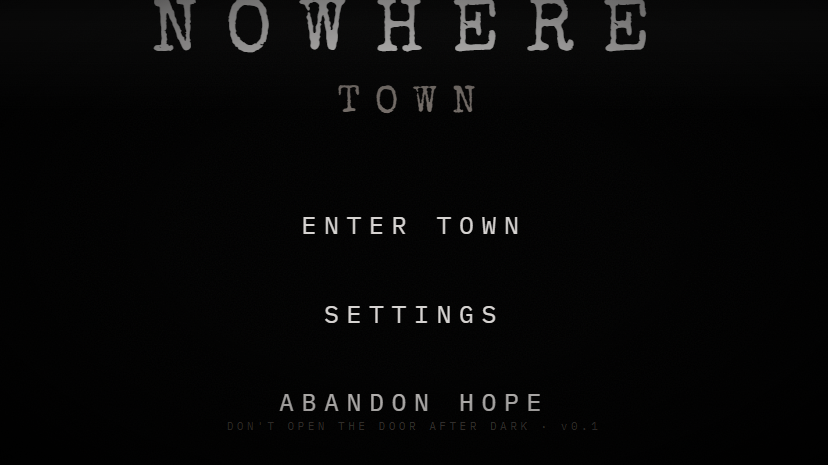
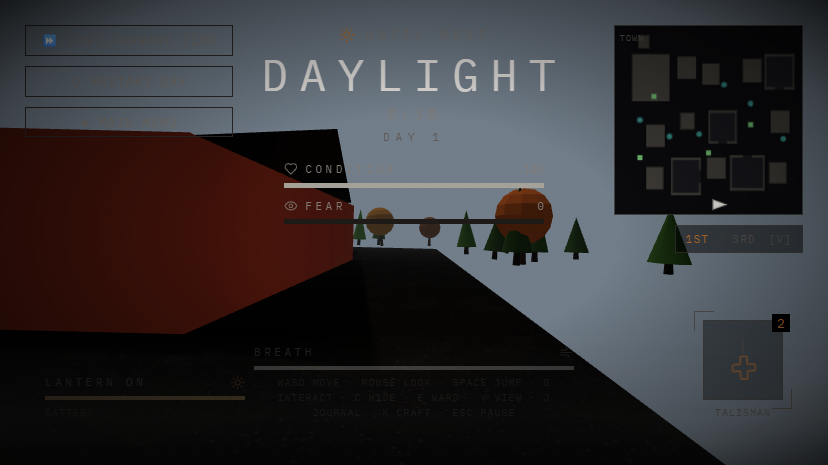
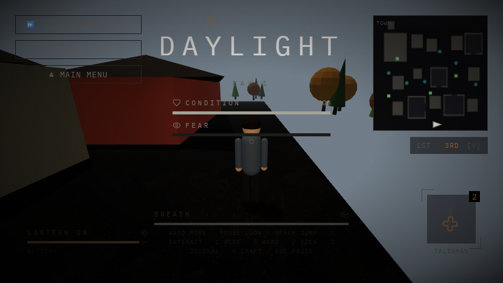
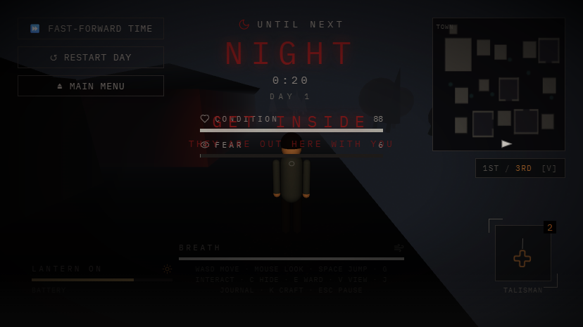

# NOWHERE TOWN

> *A place you cannot leave. Don't open the door after dark.*

A browser-based, first-person **survival stealth-horror** game inspired by the TV
series *FROM*. You are trapped in a small town that bends the rules of reality.
Explore by day, scavenge materials, and complete quests — then survive the night,
when the things outside come looking for a way in.

**▶ Play it live:** https://unigalactix.github.io/FROM-GAME/

---

## Screenshots

| Title screen | Town by day |
| --- | --- |
|  |  |

| Third-person view | Nightfall |
| --- | --- |
|  |  |

---

## Features

- **Day / night survival loop** — explore, scavenge, and complete tasks in the
  daylight; hide, ward, and survive once darkness falls.
- **Fear, condition & battery systems** — manage your nerves, your health, and
  your failing lantern.
- **A town faithful to *FROM*** — Colony House, Matthew's Diner (with its glowing
  board), the Clinic, the Church, the Sheriff's Office, the parked bus and
  ambulance, and cars that drift into town during the day and jam the street.
- **"Faraway" trees** — the mysterious trunks that teleport you somewhere else in
  town the moment you wander too close.
- **First- and third-person cameras** — switch on the fly with `V`.
- **Quests, lore, crafting & wards** — gather materials, read what the lost left
  behind, and craft charms to keep the dark at bay.
- **Procedural textures, dynamic shadows & ACES tone mapping** for a moody,
  cinematic look — all running in the browser.

## Controls

| Action | Key |
| --- | --- |
| Move | `W` `A` `S` `D` |
| Look | Mouse |
| Jump | `Space` |
| Interact | `G` |
| Hide | `C` |
| Place ward | `E` |
| Toggle camera (1st / 3rd) | `V` |
| Journal | `J` |
| Craft | `K` |
| Pause | `Esc` |

## Tech Stack

- **[Vite](https://vitejs.dev/)** — build tooling and dev server
- **[React](https://react.dev/)** — UI shell, menus, and HUD
- **[Three.js](https://threejs.org/)** + **[@react-three/fiber](https://docs.pmnd.rs/react-three-fiber)** — the 3D world (no drei)
- **[Zustand](https://github.com/pmndrs/zustand)** — game state
- **[Tailwind CSS](https://tailwindcss.com/)** — styling

## Getting Started

```bash
# Install dependencies
npm install

# Start the dev server → http://localhost:5173/FROM-GAME/
npm run dev

# Production build
npm run build

# Preview the production build locally
npm run preview
```

## Deployment

The site auto-deploys to **GitHub Pages** on every push to `main` via
[GitHub Actions](.github/workflows/deploy.yml). A manual deploy is also available:

```bash
npm run deploy   # vite build && gh-pages -d dist
```

> The Vite `base` is set to `/FROM-GAME/` so assets resolve correctly on
> GitHub Pages. If you fork this under a different repo name, update `base` in
> [vite.config.js](vite.config.js).

## Project Layout

See [AGENTS.md](AGENTS.md) for a detailed map of the codebase, architecture
notes, and conventions.

```
src/
  scenes/      # Menus, HUD, the 3D first-person scene, minimap, panels
  systems/     # Town layout, world content, the core simulation, enemies
  components/  # Reusable UI (settings, sliders, icons)
  store.js     # Zustand game state, day/night cycle, persistence
```

## Disclaimer

This is an unofficial fan project made for fun and learning. *FROM* and its
characters, locations, and likenesses are the property of their respective
rights holders. No affiliation or endorsement is implied.
